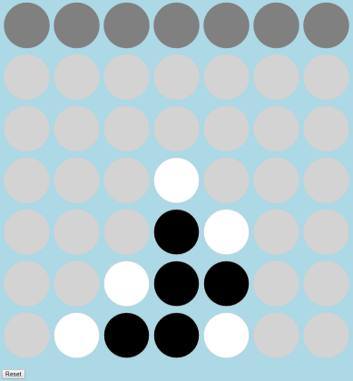

# Connect Four Game in JavaScript

This is the Connect Four game implemented in HTML/CSS/JavaScript with tests written in QUnit.

The game provides a 6 x 7 grid.  The goal of each player is to create a horizontal, vertical, or diagonal line of length 4.  Turns alternate, so you have to both plan your strategy to win, as well as defend against your opponent.

## Running the Game

Clone the repository, then double-click on the `index.html` file.

## Running the Unit Tests

Clone the repository, then double-click on the `tests.html` file.

## Supported Browsers

* Chrome
* Firefox